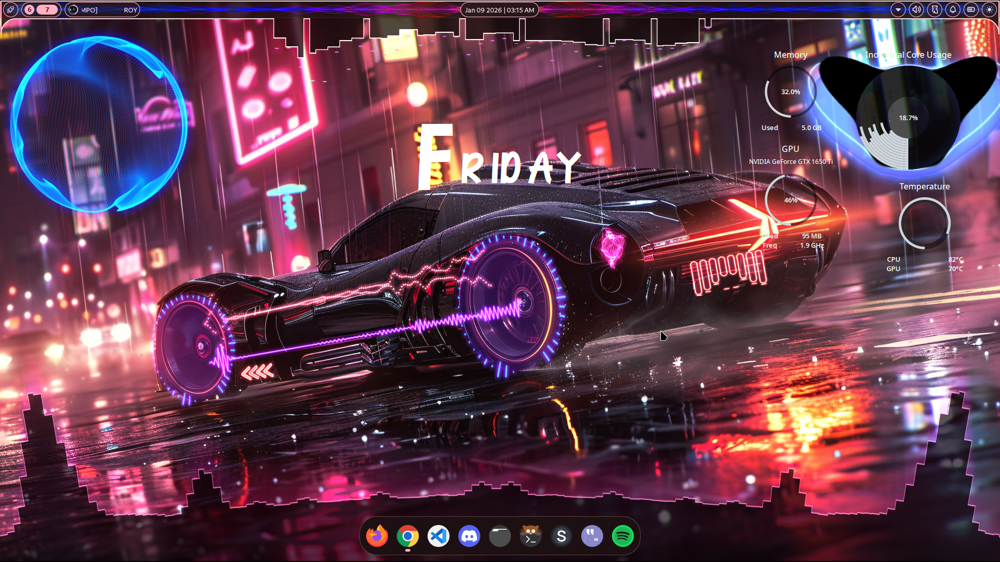
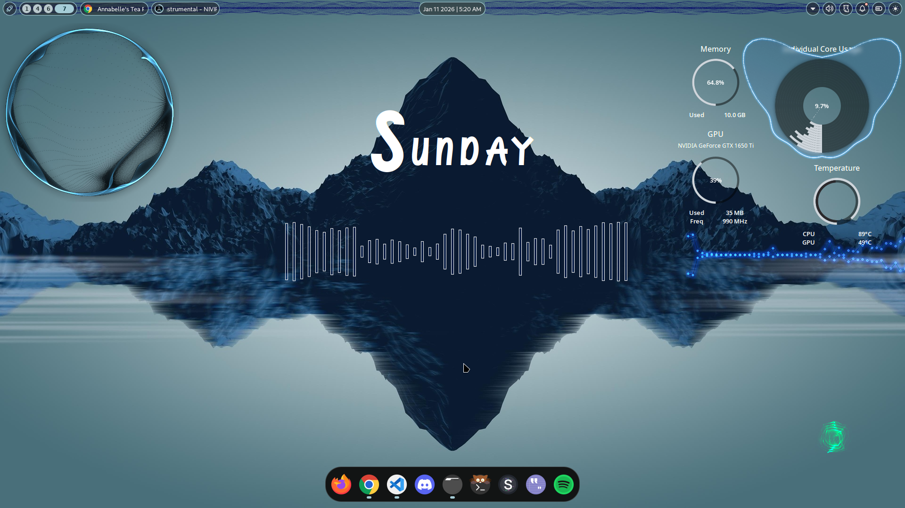
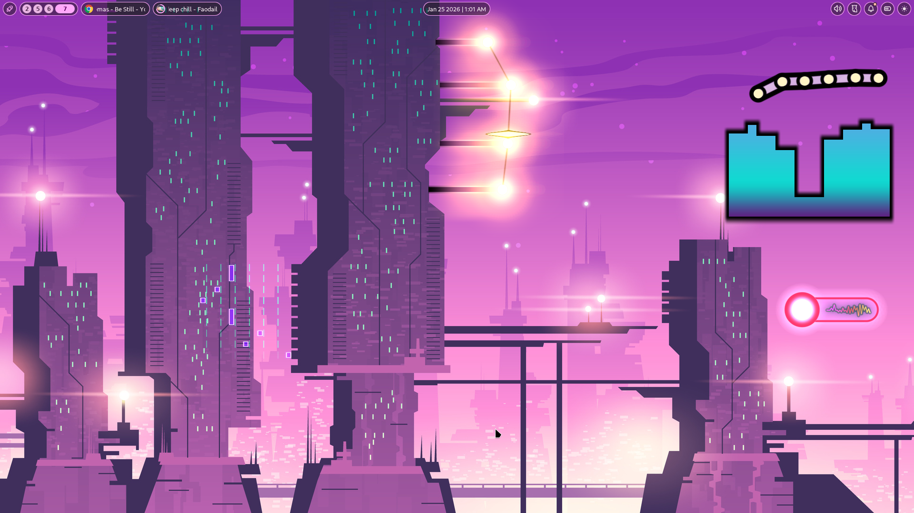
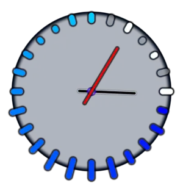

# WayVes

<figure>
  
  <figcaption>Rendered at 60 FPS using WayVes, <a href="starter-configs/wayves_logo.glsl">Configuration file here</a>
</figcaption>
</figure>

---
WayVes (**Way**land **V**isualis**e**r**s**) is an OpenGL-driven Visualiser Framework for Linux, on Wayland. Utilises PipeWire to capture Audio Data from Input or Output Devices, and displays the Visuals using the Wayland Layer Shell Protocol, specifically the GTK4 implementation of the Protocol.

## Getting Started

Check out the WayVes Wiki <a href="https://roonil.github.io">here</a>

# Features

- Multiple Visualiser types: NCS, Linear, Angular and Chain
- Modular Configuration specification via YAML
- Advanced Customisability for each Visualiser type
- Hot-reload for GLSL files: Watch your visual changes update in real-time!
- Full control over various Audio capturing and transformation properties
- Supports real-time property updates for the Visualisers using Named Pipes
- Separate Post-Processing Configuration to chain multiple effects
- Manual attribute overrides for each Visualiser Configuration File - less clutter!

# Showcase

https://github.com/user-attachments/assets/b2676b9f-d041-4f15-89f2-f0fec04cbdbb

Everything, Everywhere, All at once! (Wallpaper link: [Here](https://www.freepik.com/free-ai-image/batmobile-concept-car-with-neon-lights_233259012.htm#fromView=keyword&page=1&position=14&uuid=4847fb99-2cb4-4212-8c9d-b449f77feeeb&query=Gaming+car+wallpaper))

 

Enabling Blur using layerrules in Hyprland (top-right Visualiser) (Wallpaper link: [Here](https://4kwallpapers.com/nature/mountains-reflections-minimal-render-digital-composition-5k-38.html)): 

 

The Linear Shader (Wallpaper link: [Designed by upklyak / Freepik](https://www.freepik.com/free-vector/future-night-city-with-futuristic-skyscrapers_6612179.html)): 

 

Oh, you can get something like this too: 

 
Shows the current time, along with the currently-playing media's progress as colors that go around the clock, all made possible by just piping in the data you want!
